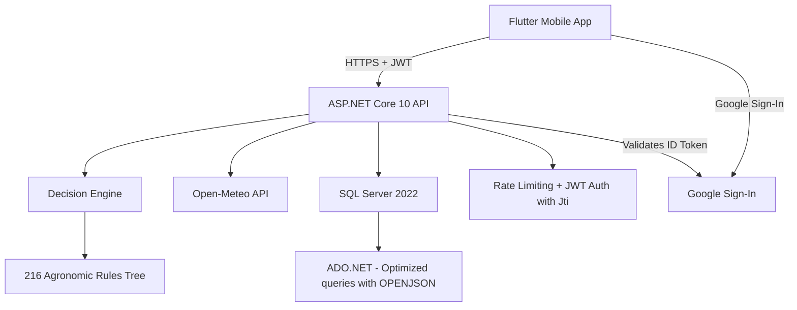

<div align="center">
  
  <br><br>

  
  
  
  
  
  
</div>

<!-- README-I18N:START -->

**English** | [Español](./README.es.md)

<!-- README-I18N:END -->

# CosechaClima

**Early-warning agroclimatic system for small-scale basic grain producers in Carazo, Nicaragua.**

Cross-references real-time weather data against an agronomic decision tree to translate weather into three concrete actions a producer can take today — at no cost, without constant connectivity, without depending on a technician being present.

---

## Table of Contents

- [The Problem](#the-problem)
- [How It Works](#how-it-works)
- [Architecture](#architecture)
- [Tech Stack](#tech-stack)
- [Repository Structure](#repository-structure)
- [Getting Started](#getting-started)
- [Security](#security)
- [Infrastructure Cost](#infrastructure-cost)
- [How to Contribute](#how-to-contribute)
- [Acknowledgments](#acknowledgments)
- [License](#license)

---

## The Problem

In Carazo, basic grains like corn and beans occupy 62% of the department's agricultural area. Small producers make critical management decisions — irrigate, drain, protect from wind — based on direct sky observation, without access to localized forecasts or an agronomic technician available every day.

CosechaClima translates open weather data into an actionable 3-step recommendation, adapted to the crop, phenological stage, and soil type of each specific plot.

## How It Works

1. The producer registers their plot: crop, phenological stage, soil type, and GPS coordinates.
2. Configures their own risk thresholds (mm of rain, km/h of wind, mid-summer drought / canícula days).
3. The system queries real weather data for the area via Open-Meteo.
4. The **decision engine** evaluates all active weather events simultaneously against a tree of **216 agronomic rules** (180 risk events + 36 "no risk") and selects the alert with the most severe risk level (High / Medium / Low / No risk) with 3 recommended actions.
5. The producer logs completed actions in their field logbook and can share a simple text summary.

**No account needed either.** The app opens in a public start screen with the 5-day forecast for the area (Carazo, or the phone's location) and only asks to sign in when doing something private, like saving a plot. Sign in with **Google** (one tap, no password to remember) or with **email and password**.

## Architecture



Strict layered architecture: each layer only knows the immediately lower one through an interface. The decision engine, for example, doesn't know if weather data comes from Open-Meteo or any other source; it only knows `IProveedorClimaticoService`.

## Tech Stack

| Layer | Technology | Justification |
|---|---|---|
| Backend | ASP.NET Core 10 | Current LTS, strong typing, performance |
| Database | SQL Server 2022 (Docker) | Developer Edition, free |
| Data Access | ADO.NET with OPENJSON | Full control over queries, optimized batch updates |
| Authentication | JWT Bearer + email/password (PBKDF2 + salt) + Google Sign-In + Jti | Google Sign-In is free: no SMS or paid services |
| Weather Data | [Open-Meteo](https://open-meteo.com) | Real forecast up to 16 days, no API key, free |
| Containerization | Docker multi-stage (Alpine) | Optimized image, non-root user |
| Mobile Client | Flutter | Single cross-platform codebase |
| CI/CD | GitHub Actions | Automated build and test |

## Repository Structure

```
CosechaClima/
|-- backend/
|   |-- WebApi/                    # API: controllers, DTOs, Program.cs
|   |-- WebApi.Models/             # Domain entities
|   |-- Services/
|   |   |-- WebApi.Interface/      # Service contracts
|   |   |-- WebApi.Implementation/ # Business logic + ADO.NET
|   |-- Scripts/                   # SQL schema, seed, rules JSON
|   |-- Dockerfile                 # Multi-stage build (SDK -> Alpine)
|-- mobile/                        # Flutter App
|-- docs/                          # Technical documentation
|-- compose.yaml                   # Docker Compose (project root)
|-- .env.example                   # Environment variables template (root)
|-- .github/workflows/             # CI/CD pipelines
|-- README.md
```

## Getting Started

The entire environment runs from the project root with Docker Compose.

**Prerequisites:** Docker + Docker Compose installed.

```bash
git clone https://github.com/Abemilek/CosechaClima.git
cd CosechaClima
cp .env.example .env
# Edit .env with your values (see comments in .env.example)
docker compose up --build -d
```

Verification:

```bash
curl http://localhost:8080/health
```

Expected: `200 OK` with `Healthy`.

> [!WARNING]
> `DB_SA_PASSWORD` must meet SQL Server complexity policy: minimum 8 characters combining at least 3 of 4 categories (uppercase, lowercase, digits, symbols).

> [!WARNING]
> SQL Server only applies `DB_SA_PASSWORD` the first time it creates the volume. If you change it later, `db` becomes `unhealthy` with `Login failed for user 'sa'`. In development: `docker compose down -v && docker compose up --build` (wipes data).

> [!NOTE]
> `ASPNETCORE_ENVIRONMENT` is `Production` by default (Swagger hidden). For local development set `ASPNETCORE_ENVIRONMENT=Development` in `.env` and open `http://localhost:8080/swagger`.

> [!NOTE]
> **Google Sign-In is optional.** Without Client IDs, the app still works with email and password. To enable it see [docs/google-sign-in-setup.md](docs/google-sign-in-setup.md). The mobile app has its own `mobile/.env` (`API_URL` and `GOOGLE_SERVER_CLIENT_ID`).

> [!NOTE]
> `compose.yaml` automatically starts: SQL Server, schema and seed scripts, and builds the API with multi-stage Dockerfile. See [backend/README.md](backend/README.md) and [mobile/README.md](mobile/README.md) for detailed instructions for each component.

## Security

- JWT authentication with configurable expiration and `Jti` claim for token uniqueness.
- Google Sign-In: the ID Token is always validated on the server (signature, audience, expiration, and verified email).
- Passwords stored exclusively as PBKDF2-SHA256 hash + individual salt per user (minimum 8 characters). Google accounts have no local password.
- Constant-time hash comparison (`CryptographicOperations.FixedTimeEquals`).
- Scoped guest mode: only `/api/auth/*`, coordinate-based forecast, catalogs, and `/health` are public; everything else requires JWT.
- Ownership-based access control on all resources, derived from the token.
- Separate `Admin` role for administrative operations, granted only via database seed.
- Rate Limiting on auth endpoints (register, login, and Google) and on the decision engine.
- Global error handler with RFC 7807 standard (`ProblemDetails`).
- CORS restricted by explicit allowed origins list.
- Secrets managed via environment variables (`.env`), never hardcoded.
- Docker runtime with Alpine image, non-root user. `Production` environment by default.

Full detail in [docs/security.md](docs/security.md).

## Infrastructure Cost

**$0.** SQL Server Developer Edition, Open-Meteo, ASP.NET Core, and the entire stack are free for this use case. The project runs completely on a laptop via Docker Compose.

## How to Contribute

This repository uses feature branches protected against `main` and [Conventional Commits](https://www.conventionalcommits.org/). Details in [CONTRIBUTING.md](CONTRIBUTING.md).

## Acknowledgments

- [Open-Meteo](https://open-meteo.com) for free access to high-resolution meteorological data.
- INTA Nicaragua and FAO for public technical guides on corn and bean management.
- [OWASP API Security Project](https://owasp.org/www-project-api-security/) as reference framework for security hardening.

## License

This project is distributed under the MIT license — see [LICENSE](LICENSE).