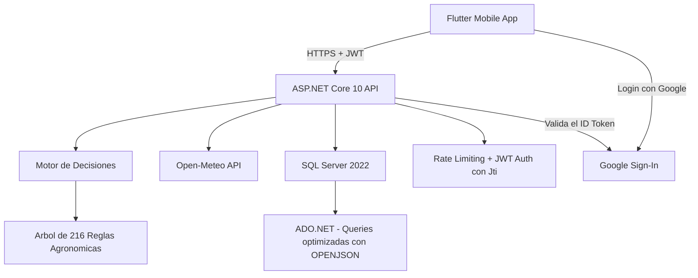

<div align="center">
  
  <br><br>

  
  
  
  
  
  
</div>

# CosechaClima

**Sistema de alerta agroclimatica temprana para pequenos productores de granos basicos en Carazo, Nicaragua.**

Cruza datos climaticos en tiempo real contra un arbol de decision agronomico para traducir el clima en tres acciones concretas que un productor puede tomar hoy -- sin costo, sin conexion constante, sin depender de un tecnico presente.

---

## Tabla de contenido

- [El problema](#el-problema)
- [Como funciona](#como-funciona)
- [Arquitectura](#arquitectura)
- [Stack tecnologico](#stack-tecnologico)
- [Estructura del repositorio](#estructura-del-repositorio)
- [Puesta en marcha](#puesta-en-marcha)
- [Seguridad](#seguridad)
- [Costo de infraestructura](#costo-de-infraestructura)
- [Como contribuir](#como-contribuir)
- [Agradecimientos](#agradecimientos)
- [Licencia](#licencia)

---

## El problema

En Carazo, los granos basicos como maiz y frijol ocupan el 62% del area agricola del departamento. Los pequenos productores toman decisiones criticas de manejo -- regar, drenar, proteger del viento -- basandose en la observacion directa del cielo, sin acceso a pronosticos localizados ni a un tecnico agronomo disponible todos los dias.

CosechaClima traduce datos climaticos abiertos en una recomendacion accionable de 3 pasos, adaptada al cultivo, la etapa fenologica y el tipo de suelo de cada parcela especifica.

## Como funciona

1. El productor registra su parcela: cultivo, etapa fenologica, tipo de suelo y coordenadas GPS.
2. Configura sus propios umbrales de riesgo (mm de lluvia, km/h de viento, dias de canicula).
3. El sistema consulta datos climaticos reales de la zona via Open-Meteo.
4. El **motor de decisiones** evalua todos los eventos climaticos activos simultaneamente contra un arbol de **216 reglas agronomicas** (180 de eventos de riesgo + 36 de "sin riesgo") y selecciona la alerta con el nivel de riesgo mas severo (Alto / Medio / Bajo / Sin riesgo) con 3 acciones recomendadas.
5. El productor registra en su bitacora de campo que acciones completo, y puede compartir un resumen de texto simple.

**Sin cuenta tambien sirve.** La app abre en un inicio publico con el pronostico de 5 dias de la zona (Carazo, o la ubicacion del telefono) y solo pide iniciar sesion al hacer algo privado, como guardar una parcela. Se puede entrar con **Google** (un toque, sin recordar contrasena) o con **correo y contrasena**.

## Arquitectura



Arquitectura en capas estricta: cada capa solo conoce a la inmediatamente inferior a traves de una interfaz. El motor de decisiones, por ejemplo, no sabe si los datos climaticos vienen de Open-Meteo o de cualquier otra fuente; solo conoce `IProveedorClimaticoService`.

## Stack tecnologico

| Capa | Tecnologia | Justificacion |
|---|---|---|
| Backend | ASP.NET Core 10 | LTS vigente, tipado fuerte, rendimiento |
| Base de datos | SQL Server 2022 (Docker) | Developer Edition, gratuita |
| Acceso a datos | ADO.NET con OPENJSON | Control total sobre consultas, batch updates optimizados |
| Autenticacion | JWT Bearer + correo/contrasena (PBKDF2 + salt) + Google Sign-In + Jti | Google Sign-In es gratuito: sin SMS ni servicios de pago |
| Datos climaticos | [Open-Meteo](https://open-meteo.com) | Pronostico real hasta 16 dias, sin API key, gratuito |
| Contenedorizacion | Docker multi-stage (Alpine) | Imagen optimizada, usuario no-root |
| Cliente movil | Flutter | Codigo unico multiplataforma |
| CI/CD | GitHub Actions | Build y test automatizados |

## Estructura del repositorio

```
CosechaClima/
|-- backend/
|   |-- WebApi/                    # API: controladores, DTOs, Program.cs
|   |-- WebApi.Models/             # Entidades de dominio
|   |-- Services/
|   |   |-- WebApi.Interface/      # Contratos de servicio
|   |   |-- WebApi.Implementation/ # Logica de negocio + ADO.NET
|   |-- Scripts/                   # Esquema SQL, seed, reglas JSON
|   |-- Dockerfile                 # Build multi-stage (SDK -> Alpine)
|-- mobile/                        # App Flutter
|-- docs/                          # Documentacion tecnica
|-- compose.yaml                   # Docker Compose (raiz del proyecto)
|-- .env.example                   # Plantilla de variables de entorno (raiz)
|-- .github/workflows/             # Pipelines CI/CD
|-- README.md
```

## Puesta en marcha

Todo el entorno se ejecuta desde la raiz del proyecto con Docker Compose.

**Prerequisitos:** Docker + Docker Compose instalados.

```bash
git clone https://github.com/Abemilek/CosechaClima.git
cd CosechaClima
cp .env.example .env
# Editar .env con tus valores (ver comentarios en .env.example)
docker compose up --build -d
```

Verificacion:

```bash
curl http://localhost:8080/health
```

Esperado: `200 OK` con `Healthy`.

> [!WARNING]
> `DB_SA_PASSWORD` debe cumplir la politica de complejidad de SQL Server: minimo 8 caracteres combinando al menos 3 de 4 categorias (mayusculas, minusculas, digitos, simbolos).

> [!WARNING]
> SQL Server solo aplica `DB_SA_PASSWORD` la primera vez que crea el volumen. Si la cambias despues, `db` queda `unhealthy` con `Login failed for user 'sa'`. En desarrollo: `docker compose down -v && docker compose up --build` (borra los datos).

> [!NOTE]
> `ASPNETCORE_ENVIRONMENT` es `Production` por defecto (Swagger oculto). Para desarrollo local poner `ASPNETCORE_ENVIRONMENT=Development` en `.env` y abrir `http://localhost:8080/swagger`.

> [!NOTE]
> **Google Sign-In es opcional.** Sin Client IDs, la app sigue funcionando con correo y contrasena. Para activarlo ver [docs/google-sign-in-setup.md](docs/google-sign-in-setup.md). La app movil tiene su propio `mobile/.env` (`API_URL` y `GOOGLE_SERVER_CLIENT_ID`).

> [!NOTE]
> `compose.yaml` inicia automaticamente: SQL Server, scripts de esquema y seed, y construye la API con Dockerfile multi-stage. Ver [backend/README.md](backend/README.md) y [mobile/README.md](mobile/README.md) para instrucciones detalladas de cada componente.

## Seguridad

- Autenticacion JWT con expiracion configurable y claim `Jti` para unicidad de token.
- Inicio de sesion con Google: el ID Token se valida siempre en el servidor (firma, audiencia, expiracion y correo verificado).
- Contrasenas almacenadas exclusivamente como hash PBKDF2-SHA256 + salt individual por usuario (minimo 8 caracteres). Las cuentas de Google no tienen contrasena local.
- Comparacion de hash en tiempo constante (`CryptographicOperations.FixedTimeEquals`).
- Modo invitado acotado: solo `/api/auth/*`, el pronostico por coordenadas, los catalogos y `/health` son publicos; todo lo demas exige JWT.
- Control de acceso por propietario (ownership) en todos los recursos, derivado del token.
- Rol `Admin` separado para operaciones administrativas, otorgado solo via seed de base de datos.
- Rate Limiting en endpoints de autenticacion (register, login y Google) y en el motor de decisiones.
- Manejador global de errores con estandar RFC 7807 (`ProblemDetails`).
- CORS restringido por lista explicita de origenes permitidos.
- Secretos gestionados por variables de entorno (`.env`), nunca hardcodeados.
- Runtime Docker con imagen Alpine, usuario no-root. Entorno `Production` por defecto.

Detalle completo en [docs/security.md](docs/security.md).

## Costo de infraestructura

**$0.** SQL Server Developer Edition, Open-Meteo, ASP.NET Core y todo el stack son gratuitos para este caso de uso. El proyecto corre completo en una laptop via Docker Compose.

## Como contribuir

Este repositorio usa ramas de feature protegidas contra `main` y [Conventional Commits](https://www.conventionalcommits.org/). Detalle en [CONTRIBUTING.md](CONTRIBUTING.md).

## Agradecimientos

- [Open-Meteo](https://open-meteo.com) por el acceso gratuito a datos meteorologicos de alta resolucion.
- INTA Nicaragua y FAO por las guias tecnicas publicas de manejo de maiz y frijol.
- [OWASP API Security Project](https://owasp.org/www-project-api-security/) como marco de referencia para el endurecimiento de seguridad.

## Licencia

Este proyecto se distribuye bajo licencia MIT -- ver [LICENSE](LICENSE).