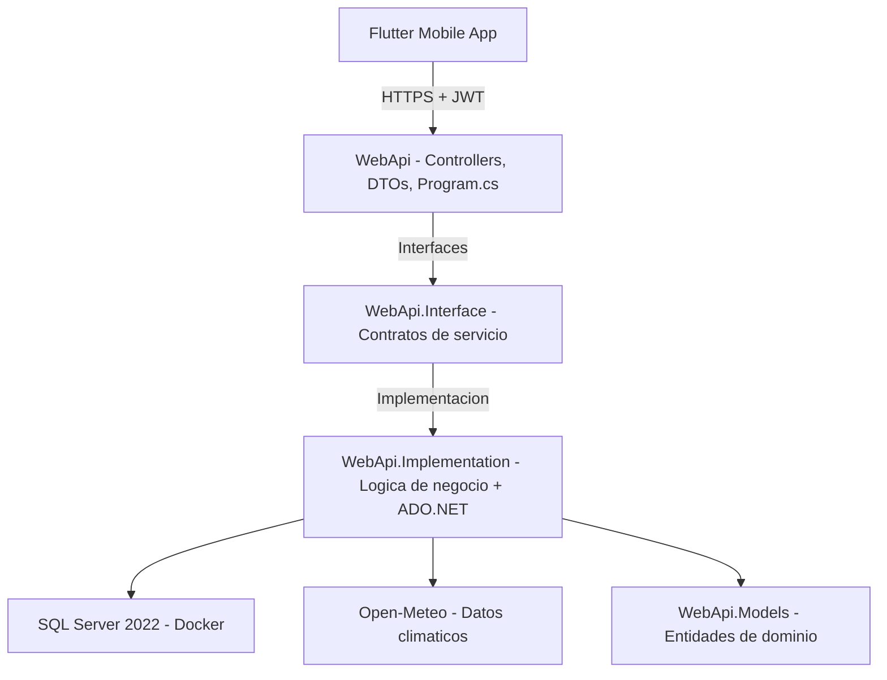

# Architecture

## Diagrama de capas



## Principio de diseno: cada capa solo conoce la de abajo, a traves de una interfaz

`WebApi.Implementation.MotorDecisionesService`, por ejemplo, no sabe si los datos climaticos vienen de Open-Meteo, de NASA POWER, o de cualquier otra fuente -- solo conoce el contrato `IProveedorClimaticoService`. Esto permitio migrar el proveedor climatico completo sin tocar el motor de decisiones, los controladores, ni la base de datos.

## Estructura de carpetas

```
CosechaClima/
|-- backend/
|   |-- WebApi/
|   |   |-- Controllers/
|   |   |-- Dto/
|   |   |-- Extensions/
|   |   |-- ManejadorErroresGlobal.cs
|   |   |-- ChequeoBaseDeDatos.cs
|   |   |-- Program.cs
|   |-- WebApi.Models/
|   |-- Services/
|   |   |-- WebApi.Interface/
|   |   |-- WebApi.Implementation/
|   |       |-- Connection/        # ConnectionBD (Singleton factory)
|   |       |-- Security/          # HashPassword, TokenGenerator, GoogleTokenValidator
|   |       |-- Exceptions/        # Excepciones de dominio
|   |-- Scripts/
|   |-- Dockerfile                 # Multi-stage (SDK -> Alpine runtime)
|-- mobile/                        # App Flutter
|-- compose.yaml                   # Docker Compose (raiz del proyecto)
|-- .env.example                   # Plantilla de entorno (raiz del proyecto)
|-- .github/workflows/             # CI/CD (GitHub Actions)
```

## Stack tecnologico

| Capa | Tecnologia | Justificacion |
|---|---|---|
| Backend | ASP.NET Core 10 | LTS vigente, tipado fuerte |
| Base de datos | SQL Server 2022 (Docker) | Developer Edition, gratuita |
| Acceso a datos | ADO.NET con OPENJSON | Control explicito de queries, optimizacion batch |
| Autenticacion | JWT Bearer + correo/contrasena (PBKDF2 + salt) + Google Sign-In (ID Token validado en el servidor) + Jti | Google es gratuito: sin SMS ni servicios de pago |
| Autorizacion | Basada en claims + rol Admin | Ownership por usuario en cada recurso |
| Datos climaticos | [Open-Meteo](https://open-meteo.com) | Pronostico real, sin API key, gratuito |
| Documentacion de API | Swagger / OpenAPI | Generada automaticamente desde el codigo |
| Contenedorizacion | Docker multi-stage (Alpine) | Imagen minima, usuario no-root |
| CI/CD | GitHub Actions | Build y test automatizados |
| Cliente movil | Flutter | Codigo unico multiplataforma |

## Autenticacion y modo invitado

Hay dos formas de tener cuenta -- correo + contrasena o Google -- y las dos terminan en el mismo JWT. La logica vive detras de interfaces, igual que el resto de las capas:

- `ITokenGenerator` (`TokenGenerator`): emite el JWT con los claims de identidad, rol y `Jti`.
- `IGoogleTokenValidator` (`GoogleTokenValidator`): valida el ID Token contra las claves publicas de Google con la libreria oficial `Google.Apis.Auth`. Devuelve un `UsuarioGoogle` ya verificado, nunca datos que mande la app sin comprobar.
- `IUsuarioService` (`UsuarioService`): registra, autentica y resuelve la cuenta de Google (por UID, por correo o nueva).

La app movil funciona **sin cuenta**: entra a un inicio publico con el pronostico de 5 dias de la zona (`GET /api/clima/pronostico`, que no persiste nada) y solo pide iniciar sesion al acceder a lo privado, como guardar una parcela. En el backend eso se traduce en que todo controlador es `[Authorize]` por defecto y solo se abren de forma explicita `/api/auth/*`, el pronostico publico, los catalogos y `/health`. Detalle en [authentication.md](./authentication.md).

## El motor de decisiones

Cruza 4 variables -- evento climatico activo, cultivo, etapa fenologica y tipo de suelo -- contra un arbol de 216 combinaciones precargadas.

A partir de la version 1.1.0, el motor evalua **todos los eventos climaticos activos simultaneamente** (no secuencialmente), consulta la regla correspondiente para cada uno, y retorna la alerta con el nivel de riesgo mas severo (Alto > Medio > Bajo). Esto elimina el "conditional shadowing" donde un evento critico podia ser silenciado por una comprobacion anterior.

El contenido del arbol vive en un archivo JSON externo (`Scripts/reglas-preliminares-completas.json`), no hardcodeado en C#, para que se pueda actualizar sin recompilar el backend.

## Ver tambien

- [security.md](./security.md) -- decisiones de seguridad y hallazgos resueltos.
- [authentication.md](./authentication.md) -- flujo de login (correo y Google), modo invitado y JWT en detalle.
- [google-sign-in-setup.md](./google-sign-in-setup.md) -- configuracion de Google Sign-In.
- [api-reference.md](./api-reference.md) -- referencia completa de endpoints.
- [changelog.md](./changelog.md) -- registro de cambios.