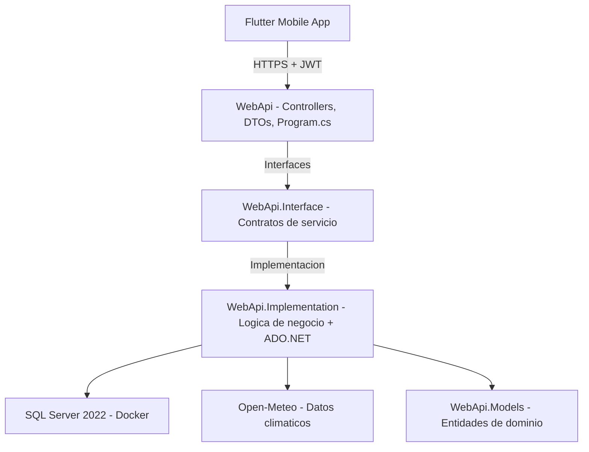

# Architecture

## Diagrama de capas



## Principio de diseno: cada capa solo conoce la de abajo, a traves de una interfaz

`WebApi.Implementation.MotorDecisionesService`, por ejemplo, no sabe si los datos climaticos vienen de Open-Meteo, de NASA POWER, o de cualquier otra fuente -- solo conoce el contrato `IProveedorClimaticoService`. Esto permitio migrar el proveedor climatico completo sin tocar el motor de decisiones, los controladores, ni la base de datos.

## Estructura de carpetas

```
CosechaClima/
|-- backend/
|   |-- WebApi/
|   |   |-- Controllers/
|   |   |-- Dto/
|   |   |-- Extensions/
|   |   |-- ManejadorErroresGlobal.cs
|   |   |-- ChequeoBaseDeDatos.cs
|   |   |-- Program.cs
|   |-- WebApi.Models/
|   |-- Services/
|   |   |-- WebApi.Interface/
|   |   |-- WebApi.Implementation/
|   |       |-- Connection/        # ConnectionBD (Singleton factory)
|   |       |-- Security/          # HashPin, TokenGenerator
|   |       |-- Exceptions/        # Excepciones de dominio
|   |-- Scripts/
|   |-- Dockerfile                 # Multi-stage (SDK -> Alpine runtime)
|-- mobile/                        # App Flutter
|-- compose.yaml                   # Docker Compose (raiz del proyecto)
|-- .env.example                   # Plantilla de entorno (raiz del proyecto)
|-- .github/workflows/             # CI/CD (GitHub Actions)
```

## Stack tecnologico

| Capa | Tecnologia | Justificacion |
|---|---|---|
| Backend | ASP.NET Core 10 | LTS vigente, tipado fuerte |
| Base de datos | SQL Server 2022 (Docker) | Developer Edition, gratuita |
| Acceso a datos | ADO.NET con OPENJSON | Control explicito de queries, optimizacion batch |
| Autenticacion | JWT Bearer + PIN (PBKDF2 + salt) + Jti | Sin dependencias externas de identidad |
| Autorizacion | Basada en claims + rol Admin | Ownership por usuario en cada recurso |
| Datos climaticos | [Open-Meteo](https://open-meteo.com) | Pronostico real, sin API key, gratuito |
| Documentacion de API | Swagger / OpenAPI | Generada automaticamente desde el codigo |
| Contenedorizacion | Docker multi-stage (Alpine) | Imagen minima, usuario no-root |
| CI/CD | GitHub Actions | Build y test automatizados |
| Cliente movil | Flutter | Codigo unico multiplataforma |

## El motor de decisiones

Cruza 4 variables -- evento climatico activo, cultivo, etapa fenologica y tipo de suelo -- contra un arbol de 216 combinaciones precargadas.

A partir de la version 1.1.0, el motor evalua **todos los eventos climaticos activos simultaneamente** (no secuencialmente), consulta la regla correspondiente para cada uno, y retorna la alerta con el nivel de riesgo mas severo (Alto > Medio > Bajo). Esto elimina el "conditional shadowing" donde un evento critico podia ser silenciado por una comprobacion anterior.

El contenido del arbol vive en un archivo JSON externo (`Scripts/reglas-preliminares-completas.json`), no hardcodeado en C#, para que se pueda actualizar sin recompilar el backend.

## Ver tambien

- [security.md](./security.md) -- decisiones de seguridad y hallazgos resueltos.
- [authentication.md](./authentication.md) -- flujo de login y JWT en detalle.
- [api-reference.md](./api-reference.md) -- referencia completa de endpoints.
- [changelog.md](./changelog.md) -- registro de cambios.
